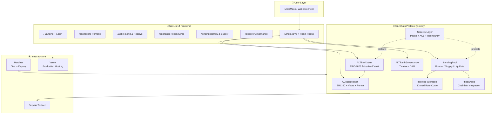

<div align="center">

<!-- Banner -->


<!-- Badges -->
[](https://soliditylang.org)
[](https://nextjs.org)
[](https://ethers.org)
[](https://hardhat.org)
[](LICENSE)
[](https://openzeppelin.com)

<br/>

[](https://github.com/Artificial-Ledger-Technology/ALT-Ledger-Bank/stargazers)
[](https://github.com/Artificial-Ledger-Technology/ALT-Ledger-Bank/network/members)
[](https://github.com/Artificial-Ledger-Technology/ALT-Ledger-Bank/issues)

</div>

---

## 🌐 What Is ALT-Ledger-Bank?

**ALT-Ledger-Bank** is a **production-grade, fully on-chain decentralized banking protocol** built by [Artificial Ledger Technology](https://github.com/Artificial-Ledger-Technology). It demonstrates how the core functions of a traditional bank — deposits, withdrawals, lending, borrowing, yield, and governance — can run entirely on smart contracts **without intermediaries**.

This is not a tutorial. It is a **complete DeFi protocol** designed to:
- 🏗️ Showcase advanced Solidity architecture (ERC-4626, kinked rate models, Chainlink oracles)
- 🎨 Deliver a stunning Web3 UI (glassmorphism, particle animations, dark theme)
- 🔐 Implement DeFi security best practices (reentrancy guards, oracle staleness, access control, pause mechanisms)
- 🗳️ Demonstrate on-chain DAO governance (OpenZeppelin Governor + Timelock)

> This project is the **complete Web3 evolution** of the original [alt-banking-system](https://github.com/Artificial-Ledger-Technology/alt-banking-system) — see [Legacy Project Recognition](#-legacy-project-recognition).

---

## 📋 Table of Contents

- [What Is ALT-Ledger-Bank?](#-what-is-alt-ledger-bank)
- [Tech Stack](#-tech-stack)
- [Architecture Overview](#-architecture-overview)
- [Features](#-features)
- [Smart Contract Addresses](#-smart-contract-addresses-sepolia-testnet)
- [Project Structure](#-project-structure)
- [Quick Start](#-quick-start)
- [Phase Documentation](#-phase-documentation)
- [Legacy Project Recognition](#-legacy-project-recognition)
- [Screenshots](#-screenshots)
- [Contributing](#-contributing)
- [License](#-license)

---

## 🚀 Tech Stack

| Layer | Technology | Purpose |
|-------|-----------|---------|
| **Smart Contracts** | Solidity `^0.8.24` | All on-chain banking logic |
| **Contract Standards** | OpenZeppelin `5.x` | ERC-20, ERC-4626, AccessControl, Governor |
| **Development** | Hardhat + TypeScript | Compile, test, deploy, gas reports |
| **Oracle** | Chainlink `AggregatorV3Interface` | Real-world price feeds for collateral |
| **Blockchain** | Ethereum / Sepolia | Testnet & mainnet deployment target |
| **Frontend** | Next.js `14` (App Router) | Premium Web3 banking interface |
| **Web3 Library** | Ethers.js `v6` | Blockchain interaction from browser |
| **Wallet** | MetaMask / WalletConnect | Wallet authentication |
| **Styling** | Tailwind CSS + Vanilla CSS | Glassmorphism, dark theme, responsive |
| **Animation** | Framer Motion | Page transitions, micro-animations |
| **Charts** | Recharts | TVL charts, yield curves, portfolio pie |
| **Testing (FE)** | Playwright | End-to-end browser automation |
| **Hosting** | Vercel | Frontend deployment |

---

## 🏛️ Architecture Overview



---

## ✨ Features

### 🔐 Smart Contract Protocol

| Feature | Contract | Standard |
|---------|----------|----------|
| **ERC-20 Governance Token** | `ALTBankToken.sol` | ERC-20, ERC20Votes, ERC20Permit |
| **Tokenized Deposit Vault** | `ALTBankVault.sol` | **ERC-4626** |
| **Collateralized Lending** | `LendingPool.sol` | Custom (Aave-inspired) |
| **Dynamic Interest Rates** | `InterestRateModel.sol` | Kinked two-slope curve |
| **Price Oracle** | `PriceOracle.sol` | Chainlink AggregatorV3 |
| **On-Chain Governance** | `Governance.sol` | OpenZeppelin Governor |
| **Emergency Circuit Breaker** | `EmergencyStop.sol` | OpenZeppelin Pausable |
| **Role-Based Access** | `ALTAccessControl.sol` | OpenZeppelin AccessControl |

### 🎨 Frontend Banking Interface

- **Animated Particle Background** — bokeh orb canvas matching the ALTBank visual identity
- **Glassmorphism UI** — frosted glass cards, gradient buttons, deep blue theme
- **Hero Carousel** — 3-slide auto-rotating landing page
- **Portfolio Dashboard** — TVL, APY, Health Factor, and Yield History charts
- **Wallet Management** — token balances, send/receive, transaction history
- **Lending Interface** — supply/borrow with real-time Health Factor gauge
- **Governance Portal** — browse and vote on live DAO proposals
- **Dark / Light Mode** — persisted theme preference

### 🛡️ Security Architecture

- ✅ **Reentrancy Guard** — all state-mutating external functions protected
- ✅ **Pause Mechanism** — deposits/borrows pausable; withdrawals never blocked
- ✅ **Access Control** — `ADMIN`, `OPERATOR`, `MINTER`, `ORACLE_ADMIN` roles
- ✅ **Oracle Staleness Check** — rejects stale Chainlink prices (>1 hour old)
- ✅ **Inflation Attack Prevention** — dead shares minted at vault construction
- ✅ **Health Factor Enforcement** — LendingPool blocks unsafe borrows on-chain
- ✅ **Liquidation Incentive** — 5% bonus ensures protocol remains solvent

---

## 📝 Smart Contract Addresses (Sepolia Testnet)

> Contracts are fully verified on Etherscan. Source code readable by anyone.

| Contract | Address | Etherscan |
|----------|---------|-----------|
| `ALTBankToken` | `Pending deployment` | — |
| `ALTBankVault` | `Pending deployment` | — |
| `LendingPool` | `Pending deployment` | — |
| `InterestRateModel` | `Pending deployment` | — |
| `PriceOracle` | `Pending deployment` | — |
| `ALTBankGovernance` | `Pending deployment` | — |
| `TimelockController` | `Pending deployment` | — |

> *Addresses will be populated after Phase 3 (Integration & Deployment) is complete.*

---

## 📁 Project Structure

```
ALT-Ledger-Bank/
│
├── contracts/                        # Hardhat project (Solidity)
│   ├── contracts/
│   │   ├── core/
│   │   │   ├── ALTBankToken.sol      # ERC-20 + Votes + Permit
│   │   │   ├── ALTBankVault.sol      # ERC-4626 Tokenized Vault
│   │   │   ├── LendingPool.sol       # Borrow / Supply / Liquidate
│   │   │   ├── InterestRateModel.sol # Kinked Rate Curve
│   │   │   ├── PriceOracle.sol       # Chainlink Wrapper
│   │   │   └── Governance.sol        # DAO + Timelock
│   │   ├── security/
│   │   │   ├── EmergencyStop.sol     # Circuit Breaker
│   │   │   └── ALTAccessControl.sol  # RBAC
│   │   ├── interfaces/               # IVault, ILendingPool, IPriceOracle
│   │   └── libraries/
│   │       └── WadMath.sol           # 18-decimal fixed-point math
│   ├── scripts/
│   │   ├── deploy.ts                 # Orchestrated deployment
│   │   └── configure.ts             # Post-deploy config
│   ├── test/                         # Unit + Integration tests (>90% coverage)
│   └── hardhat.config.ts
│
├── frontend/                         # Next.js 14 app
│   ├── src/
│   │   ├── app/                      # App Router pages
│   │   │   ├── page.tsx              # / — Landing + Hero
│   │   │   ├── dashboard/page.tsx    # /dashboard
│   │   │   ├── wallet/page.tsx       # /wallet
│   │   │   ├── exchange/page.tsx     # /exchange
│   │   │   ├── lending/page.tsx      # /lending
│   │   │   └── explore/page.tsx      # /explore — Governance
│   │   ├── components/               # Navbar, HeroCarousel, Charts, Modals...
│   │   ├── hooks/                    # useWallet, useVault, useLending...
│   │   ├── providers/                # Web3Provider, ThemeProvider
│   │   └── services/                 # Contract ABIs + typed instances
│   └── package.json
│
├── docs/                             # Full phase documentation
│   ├── INDEX.md
│   ├── PHASE_0_PROJECT_INITIALIZATION.md
│   ├── PHASE_1_SMART_CONTRACTS.md
│   ├── PHASE_2_FRONTEND.md
│   ├── PHASE_3_INTEGRATION.md
│   ├── PHASE_4_POLISH.md
│   ├── CODE_REVIEW_PHASE0.md         # GitHub Kanban issue source
│   ├── CODE_REVIEW_PHASE1.md
│   ├── CODE_REVIEW_PHASE2.md
│   ├── CODE_REVIEW_PHASE3.md
│   └── CODE_REVIEW_PHASE4.md
│
├── .env.example                      # Environment variable template
├── .gitignore
└── package.json                      # Root npm workspace
```

---

## ⚡ Quick Start

### Prerequisites

| Tool | Version | Install |
|------|---------|---------|
| Node.js | `>= 20 LTS` | [nodejs.org](https://nodejs.org) |
| npm | `>= 10` | Included with Node |
| MetaMask | Latest | [metamask.io](https://metamask.io) |
| Git | Any | [git-scm.com](https://git-scm.com) |

### Installation

```bash
# 1. Clone the repository
git clone https://github.com/Artificial-Ledger-Technology/ALT-Ledger-Bank.git
cd ALT-Ledger-Bank

# 2. Configure environment variables
cp .env.example .env
# Open .env and fill in your SEPOLIA_RPC_URL, DEPLOYER_PRIVATE_KEY, etc.

# 3. Install all workspace dependencies
npm install
```

### Run Smart Contracts (Local)

```bash
# Compile all Solidity contracts
npm run contracts:compile

# Run unit tests
npm run contracts:test

# Start local Hardhat blockchain
npx hardhat node --cwd contracts

# Deploy to local network (new terminal)
npx hardhat run scripts/deploy.ts --network localhost --config contracts/hardhat.config.ts
```

### Run Frontend

```bash
# Start Next.js development server
npm run frontend:dev

# Open in browser
open http://localhost:3000
```

### Deploy to Sepolia Testnet

```bash
# 1. Ensure SEPOLIA_RPC_URL and DEPLOYER_PRIVATE_KEY are set in .env
# 2. Ensure deployer wallet has Sepolia ETH (get from https://sepoliafaucet.com)
# 3. Deploy all contracts
npx hardhat run contracts/scripts/deploy.ts --network sepolia

# 4. Verify on Etherscan
npx hardhat verify --network sepolia <CONTRACT_ADDRESS> <CONSTRUCTOR_ARGS>

# 5. Update .env with deployed addresses, then deploy frontend
npm run frontend:build
```

---

## 📚 Phase Documentation

The project is built in 5 structured phases. All documentation lives in the [`docs/`](./docs/) folder.

| Phase | Status | Documentation | Kanban Tasks |
|-------|--------|--------------|-------------|
| **Phase 0**: Project Init | 🟡 In Progress | [PHASE_0](./docs/PHASE_0_PROJECT_INITIALIZATION.md) | [Tasks](./docs/CODE_REVIEW_PHASE0.md) |
| **Phase 1**: Smart Contracts | 🔵 Planned | [PHASE_1](./docs/PHASE_1_SMART_CONTRACTS.md) | [Tasks](./docs/CODE_REVIEW_PHASE1.md) |
| **Phase 2**: Frontend | 🔵 Planned | [PHASE_2](./docs/PHASE_2_FRONTEND.md) | [Tasks](./docs/CODE_REVIEW_PHASE2.md) |
| **Phase 3**: Integration | 🔵 Planned | [PHASE_3](./docs/PHASE_3_INTEGRATION.md) | [Tasks](./docs/CODE_REVIEW_PHASE3.md) |
| **Phase 4**: Polish | 🔵 Planned | [PHASE_4](./docs/PHASE_4_POLISH.md) | [Tasks](./docs/CODE_REVIEW_PHASE4.md) |

> **44 total tasks · 228 estimated development hours**  
> See the [Documentation Index](./docs/INDEX.md) for the complete overview.

---

## 🏛️ Legacy Project Recognition

<div align="center">

### 🎖️ Built on the Foundation of the Original ALT Banking System

</div>

> This repository is a **complete Web3 reimagination** of the original Artificial Ledger Technology banking system.

| | Legacy Project | This Project |
|-|---------------|-------------|
| **Repository** | [alt-banking-system](https://github.com/Artificial-Ledger-Technology/alt-banking-system) | [ALT-Ledger-Bank](https://github.com/Artificial-Ledger-Technology/ALT-Ledger-Bank) |
| **Technology** | Spring Boot · React · MySQL | Solidity · Next.js · Ethers.js |
| **Architecture** | Centralized (Client-Server) | Decentralized (On-Chain) |
| **Database** | MySQL RDBMS | Ethereum Blockchain |
| **Auth** | Username + Password | Wallet Signature (EIP-712) |
| **Year** | ~2022–2023 | 2026 |
| **Status** | ✅ Archived | 🔄 Active Development |

The original `alt-banking-system` was created as a capstone project for our Introduction to Programming course — a Java/Spring Boot banking system with React frontend and MySQL backend. It demonstrated CRUD operations, transaction history, account management, and security measures in a traditional web architecture.

**ALT-Ledger-Bank** takes every concept from that project and rebuilds it as a fully trustless, permissionless financial protocol — honoring the original vision while pushing it three years into the future.

> 💎 *If you built with us on the original project, you are recognized here. That work made this possible.*

---

## 🎨 Screenshots

<div align="center">

> *Screenshots will be added upon Phase 2 frontend completion*

| Landing Page | Dashboard | Lending |
|:---:|:---:|:---:|
| 🖼️ *Coming Soon* | 🖼️ *Coming Soon* | 🖼️ *Coming Soon* |

</div>

---

## 🏆 Contributing

<div align="center">

### Artificial Ledger Technology · Team Directory

</div>

ALT-Ledger-Bank is built by the dedicated divisions of **[Artificial Ledger Technology](https://github.com/Artificial-Ledger-Technology)** 🇵🇭

We recognize the following teams for their contributions to this protocol and the broader ALT ecosystem:

---

<table align="center">
  <tr>
    <th>⛓️ Blockchain Technology</th>
    <th>🔐 Cybersecurity — Digital Forensics</th>
  </tr>
  <tr>
    <td align="center">
      Responsible for all Solidity smart contract design, DeFi protocol architecture, Hardhat toolchain, testnet deployment, Chainlink oracle integration, and on-chain governance systems.
    </td>
    <td align="center">
      Responsible for smart contract security reviews, access control patterns, reentrancy analysis, oracle manipulation prevention, and digital forensics on transaction data.
    </td>
  </tr>
  <tr>
    <th>💻 Full Stack Development</th>
    <th>🚀 Special Projects</th>
  </tr>
  <tr>
    <td align="center">
      Responsible for the Next.js 14 frontend, Web3 wallet integration, Ethers.js contract layer, UI component system, glassmorphism design, chart visualizations, and Vercel deployment.
    </td>
    <td align="center">
      Responsible for cross-team initiatives, research spikes, non-standard integrations, and forward-looking DeFi experiments that inform the protocol roadmap.
    </td>
  </tr>
</table>

---

### How to Contribute

We welcome contributions from the Web3 community! Here's how to get started:

1. **Fork** the repository and create your branch from `main`
   ```bash
   git checkout -b feat/your-feature-name
   ```
2. **Follow the phase docs** — read the relevant `docs/CODE_REVIEW_PHASE*.md` before working on contracts or frontend
3. **Write tests** — all smart contract changes require accompanying tests (target >90% coverage)
4. **Conventional commits** — use the format: `feat(contracts): add flash loan support`
5. **Open a Pull Request** — link the relevant GitHub issue and fill in the PR template

### Contribution Categories

| Type | Label | Examples |
|------|-------|---------|
| Smart Contract | `contracts` | New features, gas optimization, security fixes |
| Frontend | `frontend` | New pages, UI improvements, hook fixes |
| Documentation | `docs` | Phase docs, README, inline code comments |
| Testing | `testing` | New test cases, coverage improvements |
| Infrastructure | `devops` | CI/CD, deployment scripts |
| Security | `security` | Vulnerability reports (see below) |

### Security Vulnerabilities

> ⚠️ **Do NOT file public issues for security vulnerabilities.**  
> Contact the ALT Cybersecurity & Digital Forensics team via the private security advisory channel on GitHub.

---

## 🗺️ Roadmap

- [x] Phase 0: Project Initialization & Documentation
- [ ] Phase 1: Smart Contract Development (Solidity)
- [ ] Phase 2: Frontend — Next.js + Ethers.js
- [ ] Phase 3: Integration & Testnet Deployment
- [ ] Phase 4: Polish & Job-Market Differentiation
- [ ] Phase 5 (Future): Mainnet Deployment + Audits
- [ ] Phase 6 (Future): Flash Loans + Yield Optimization Strategies
- [ ] Phase 7 (Future): Mobile App (React Native + WalletConnect)

---

## 🔐 License

```
MIT License

Copyright (c) 2026 Artificial Ledger Technology

Permission is hereby granted, free of charge, to any person obtaining a copy
of this software and associated documentation files (the "Software"), to deal
in the Software without restriction, including without limitation the rights
to use, copy, modify, merge, publish, distribute, sublicense, and/or sell
copies of the Software, and to permit persons to whom the Software is
furnished to do so, subject to the following conditions:

The above copyright notice and this permission notice shall be included in all
copies or substantial portions of the Software.

THE SOFTWARE IS PROVIDED "AS IS", WITHOUT WARRANTY OF ANY KIND, EXPRESS OR
IMPLIED, INCLUDING BUT NOT LIMITED TO THE WARRANTIES OF MERCHANTABILITY,
FITNESS FOR A PARTICULAR PURPOSE AND NONINFRINGEMENT.
```

See the [LICENSE](./LICENSE) file for the full text.

---

## 🔭 Acknowledgements

- [OpenZeppelin](https://openzeppelin.com) — Battle-tested smart contract primitives
- [Chainlink](https://chain.link) — Decentralized oracle network
- [Aave Protocol](https://aave.com) — Inspiration for the interest rate model and health factor design
- [Hardhat](https://hardhat.org) — Ethereum development environment
- [Next.js](https://nextjs.org) — The React framework for production
- [Ethers.js](https://ethers.org) — Compact, complete Ethereum library

---

<div align="center">


<br/>


<br/>

**[⭐ Star this repo](https://github.com/Artificial-Ledger-Technology/ALT-Ledger-Bank) · [🐛 Report a Bug](https://github.com/Artificial-Ledger-Technology/ALT-Ledger-Bank/issues) · [💡 Request a Feature](https://github.com/Artificial-Ledger-Technology/ALT-Ledger-Bank/issues)**

<br/>

*Built with 💎 by [Artificial Ledger Technology](https://github.com/Artificial-Ledger-Technology)*


</div>
